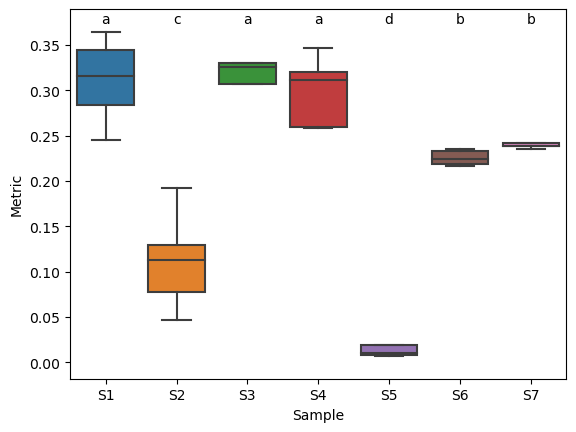
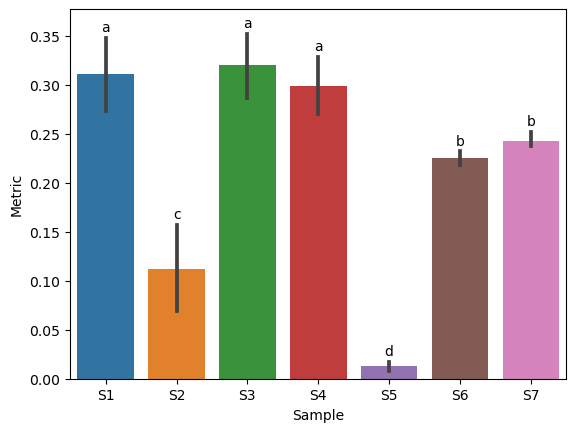

# Cld4py is a Python3 package that allows to assign compact letter display and can add them to seaborn/matplotlib figures

Function to apply compact letter display for pairwise contrasts.

Groups with no significant differences share a letter.

It also can be used for plotting letters to seaborn/matplotlib figures.

## Installation


```python
pip install cld4py
```

## Package content

Cld4py currently includes two functions:
- assign_letters(): this function will assign CLD letters to the contrasts
- plot_letters(): this function can add CLD letters to matplotlib/seaborn figures

## Parameters


```python
assign_letters()
    """
    Function to apply compact letter display for pairwise contrasts.
    Groups with no significant differences share a letter.
    
    Parameters:
    
      Required:
        df    - dataframe with contrasts (pairwise comparisons).
        G1, G2 - columns in contrasts df with compared groups.
        P      - column in contrasts df with p-value (adjusted, right?).
        
      Optional:
        alpha  - sigificance level (default 0.05).
        order  - None (default), list or ['ascending', 'descending'].
                 This parameter will define the order of assigned letters.
                 None - alphabetical order will be applied.
                 List - order of groups will be defined by that list.
                 String 'ascending' or 'descending' requires parameters
                 'data', 'values' and 'group' to order groups by the mean.
        data   - dataframe with values that were compared to get contrasts.
        vals   - column in data with compared values.
        group  - column in data with group information.
    """
        
plot_letters()
    """
    Function to plot CLD letters for sns boxplot, violinplot, barplot or swarmplot.
    Groups with no significant differences share a letter.
    
    Parameters:
    
      Required:
        cld    - dataframe or dictionary with groups and letters. If df then groups 
                 should be in the index and letters in the "Letters" column.
        data   - dataframe with values that were plotted.
        vals   - column in data with compared values.
        group  - column in data with group information.
        figax  - matplotlib or sns figure or ax with plot.
        
      Optional:
        axis   - axis with plotted groups: "x" or "y" (default "x").
        plot   - plot type: "boxplot", "violinplot", "barplot" or "swarmplot"
                 (default "boxplot").
        pos    - letters position: "upper", "lower", "top" or "bottom" 
                 (default: "upper"). If axis = "y", "upper" and "top" will be 
                 plotted on the right side, "lower" and "bottom" - on the left.
        pad    - distance (% of data range) to the plotted group object (default 1).     
        c      - color of letters.
        fs     - fontsize of letters.
        lim    - increase axes limits, expressed in "pad" (see above) values (default 0)
    """
```

## Usage examples


```python
import cld4py
import pandas as pd
import seaborn as sns
import matplotlib.pyplot as plt
%matplotlib inline

cont = pd.read_csv('tests/contrasts.tsv', sep='\t')
data = pd.read_csv('tests/data.tsv', sep='\t')

order = sorted(data.Sample.unique().tolist())

cld = cld4py.assign_letters(cont, 'Group1', 'Group2', 'P-adj', order='descending', 
                            data=data, vals='Metric', group='Sample')
cld
```


<div>

<table border="1" class="dataframe">
  <thead>
    <tr style="text-align: right;">
      <th></th>
      <th>Letters</th>
    </tr>
    <tr>
      <th>Group</th>
      <th></th>
    </tr>
  </thead>
  <tbody>
    <tr>
      <th>S3</th>
      <td>a</td>
    </tr>
    <tr>
      <th>S1</th>
      <td>a</td>
    </tr>
    <tr>
      <th>S4</th>
      <td>a</td>
    </tr>
    <tr>
      <th>S7</th>
      <td>b</td>
    </tr>
    <tr>
      <th>S6</th>
      <td>b</td>
    </tr>
    <tr>
      <th>S2</th>
      <td>c</td>
    </tr>
    <tr>
      <th>S5</th>
      <td>d</td>
    </tr>
  </tbody>
</table>
</div>


### Boxplots


```python
#boxplot x upper
fig, ax = plt.subplots(1, 1, )
sns.boxplot(y='Metric', x='Sample', data=data, ax=ax, order=order, showfliers=False)

cld4py.plot_letters(cld=cld, data=data, figax=ax, axis='x', plot='boxplot', pos='upper', 
            vals='Metric', group='Sample', pad=1, c='black', fs=None, lim=1)
plt.savefig(f'tests/Figures/Boxplot_x_upper.png')

#boxplot x top
fig, ax = plt.subplots(1, 1, )
sns.boxplot(y='Metric', x='Sample', data=data, ax=ax, order=order, showfliers=False)

cld4py.plot_letters(cld=cld, data=data, figax=ax, axis='x', plot='boxplot', pos='top', 
            vals='Metric', group='Sample', pad=1, c='black', fs=None, lim=2)

#boxplot y lower
fig, ax = plt.subplots(1, 1, )
sns.boxplot(x='Metric', y='Sample', data=data, ax=ax, order=order, showfliers=False)

cld4py.plot_letters(cld=cld, data=data, figax=ax, axis='y', plot='boxplot', pos='lower', 
            vals='Metric', group='Sample', pad=1, c='black', fs=None, lim=2)

#boxplot y bottom
fig, ax = plt.subplots(1, 1, )
sns.boxplot(x='Metric', y='Sample', data=data, ax=ax, order=order, showfliers=False)

cld4py.plot_letters(cld=cld, data=data, figax=ax, axis='y', plot='boxplot', pos='bottom', 
            vals='Metric', group='Sample', pad=1, c='black', fs=None, lim=2)
plt.savefig(f'tests/Figures/Boxplot_y_bottom.png')
```





### Violinplots


```python
#violinplot x upper
fig, ax = plt.subplots(1, 1, )
sns.violinplot(y='Metric', x='Sample', data=data, ax=ax, order=order,)

cld4py.plot_letters(cld=cld, data=data, figax=ax, axis='x', plot='violinplot', pos='upper', 
            vals='Metric', group='Sample', pad=2, c='black', fs=None, lim=2)
plt.savefig(f'tests/Figures/Violinplot_x_upper.png')

#violinplot y top
fig, ax = plt.subplots(1, 1, )
sns.violinplot(x='Metric', y='Sample', data=data, ax=ax, order=order,)

cld4py.plot_letters(cld=cld, data=data, figax=ax, axis='y', plot='violinplot', pos='top', 
            vals='Metric', group='Sample', pad=2, c='black', fs=None, lim=2)

```


### Barplots


```python
#barplot x upper
fig, ax = plt.subplots(1, 1, )
sns.barplot(y='Metric', x='Sample', data=data, ax=ax, order=order,)

cld4py.plot_letters(cld=cld, data=data, figax=ax, axis='x', plot='barplot', pos='upper', 
            vals='Metric', group='Sample', pad=1, c='black', fs=None, lim=2)
plt.savefig(f'tests/Figures/Barplot_x_upper.png')

#barplot y top
fig, ax = plt.subplots(1, 1, )
sns.barplot(x='Metric', y='Sample', data=data, ax=ax, order=order,)

cld4py.plot_letters(cld=cld, data=data, figax=ax, axis='y', plot='barplot', pos='top', 
            vals='Metric', group='Sample', pad=1, c='black', fs=None, lim=2)
```




```python
#swarmplot x upper
fig, ax = plt.subplots(1, 1, )
sns.swarmplot(y='Metric', x='Sample', data=data, ax=ax, order=order,)

cld4py.plot_letters(cld=cld, data=data, figax=ax, axis='x', plot='swarmplot', pos='upper', 
            vals='Metric', group='Sample', pad=2, c='black', fs=None, lim=2)

#swarmplot y bottom
fig, ax = plt.subplots(1, 1, )
sns.swarmplot(x='Metric', y='Sample', data=data, ax=ax, order=order,)

cld4py.plot_letters(cld=cld, data=data, figax=ax, axis='y', plot='swarmplot', pos='bottom', 
            vals='Metric', group='Sample', pad=2, c='black', fs=None, lim=2)
```


```python

```
